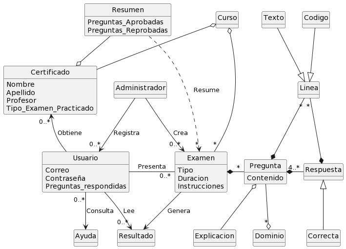
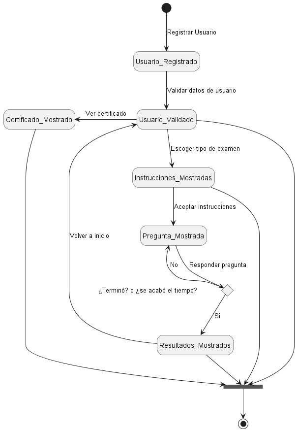
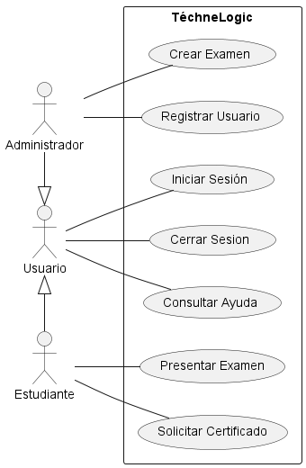
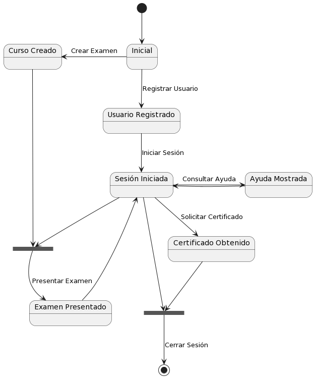

# Proyecto-IS-Grupo-1
## Integrantes
* Valeria Ciccolella
* Jesús Cova
* Samuel Flores
* Lisangely Goncalves
* Sofía Marcano
* Gabriel Valero
## Modelado de Dominio : 
### Diagrama de Clases

### Diagrama de Estados

## Modelado de Casos de Uso : 
### Diagrama de Casos de Uso

### Diagrama de Estados de los Casos de Uso

### Especificaciones de los Casos de Uso
- [CrearExamen](/docs/scenariosView/CUCrearExamen.pdf).
- [PresentarExamen](/docs/scenariosView/CUPresentarExamen.pdf)
- [SolicitarCertificado](/docs/scenariosView/CUSolicitarCertificado.pdf)
### Prototipos de pantallas