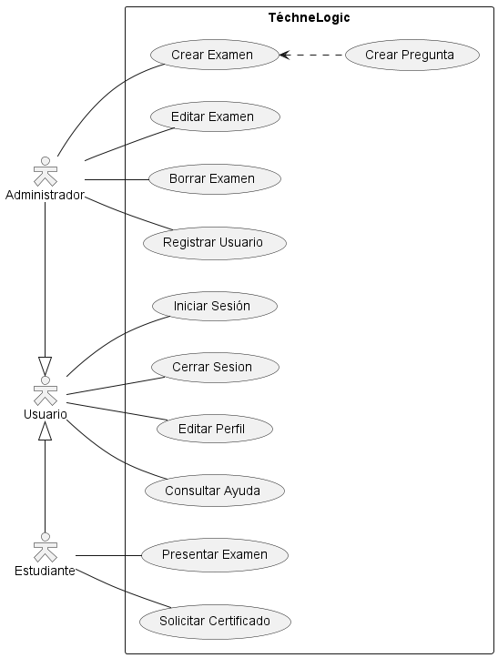
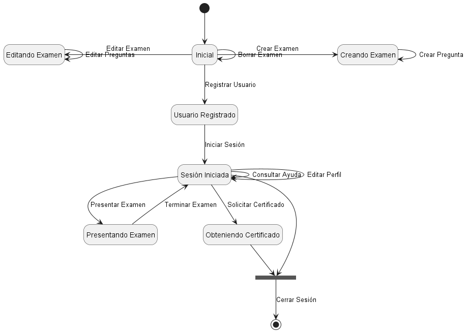
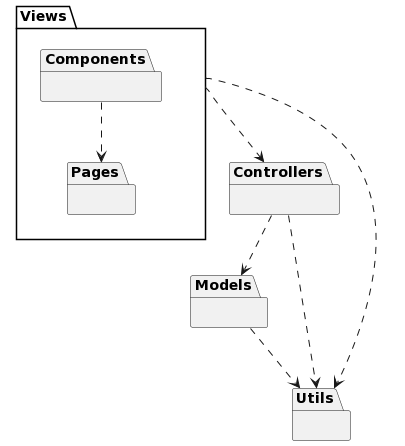

# Proyecto-IS-Grupo-1
## Integrantes
* Valeria Ciccolella
* Jesús Cova
* Samuel Flores
* Lisangely Goncalves
* Sofía Marcano
* Gabriel Valero
## Modelado de Dominio : 
### Diagrama de Clases

### Diagrama de Estados

## Modelado de Casos de Uso : 
### Diagrama de Casos de Uso

### Diagrama de Estados de los Casos de Uso

### Especificaciones de los Casos de Uso
- [CrearExamen](/docs/scenariosView/useCases/CUCrearExamen.pdf)
- [CrearPregunta](/docs/scenariosView/useCases/CUCrearPregunta.pdf)
- [PresentarExamen](/docs/scenariosView/useCases/CUPresentarExamen.pdf)
- [SolicitarCertificado](/docs/scenariosView/useCases/CUSolicitarCertificado.pdf)
## Prototipos de pantallas
### Flujo de Usuario

### Flujo de Administrador
      
### Prototipado Interactivo
- [Prototipado en Figma](https://www.figma.com/proto/t3JwDM1Ml5MX22OzwAK5At/Modelo-de-Prototipos-IS---Grupo-1?page-id=0%3A1&type=design&node-id=1-2&viewport=-156%2C482%2C0.15&t=mA4RJ4fKFYQQwOEy-1&scaling=min-zoom&starting-point-node-id=1%3A2&show-proto-sidebar=1&mode=design)
- [Pantallas](/out/docs/PROTOTYPES.md)

## Modelado de Análisis
### Diagrama de clases de analisis

### Diagrama de clases de análisis y de colaboración de casos de uso prioritarios
#### UC1-Create Exam

#### UC2-Present Exam

#### UC3-Request Certificate

### Diagrama de paquetes de análisis

## Modelo de Diseño

### Diagrama de clases

### Diagrama de secuencia

### Diagrama de Traza

## Modelo de Despliegue

## Modelo de Implementacion
#### Utilizamos la libreria externa iTextPDF version 5.5.12, se encuentra en la carpeta lib dentro de src. La llama  GeneratePDFFile que se encuentra en la carpeta de controladores

## Modelo de pruebas
* PresentExamControllerTest
  - testReadIndformation()
* RequestCertificateControllerTest
  - readStudentDataTest()
  - showCertificatesTest()
* RegisterUserControllerTest
  - writeFileTest()
  - searchUserTest()
  - RegisterNewUserTest()
* ExamTest
  - testExam()
  - testExamIsEmpty()

## Historias de Usuario
### Cambios de requisitos
#### Requisito: Añadir imagen a una pregunta

#### Requisito: Crear preguntas de seleccion multiple

## Iniciar el programa
#### El programa se corre desde la clase Main
#### Para hacer Login 
* Como usuario corriente:
  - user = Usuario
  - password = Contrasenia
* Como administrador:
  - user = Profesor
  - password = contrasenia
